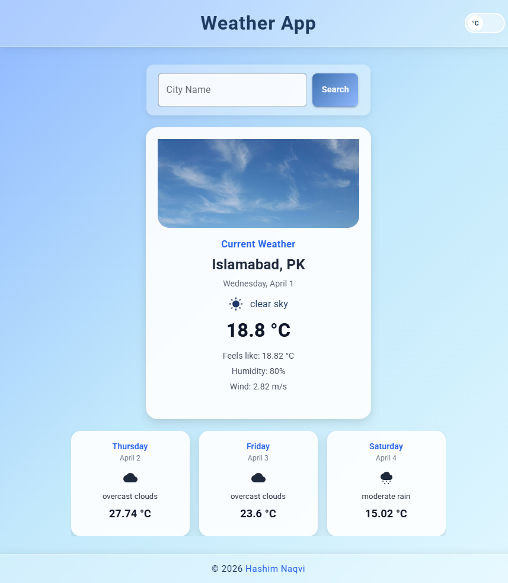

# Weather App

A user-friendly weather application built with **React** that allows users to check real-time weather conditions for any city or their current location. When the app opens, it first tries to fetch weather data for the user’s current location. If location access is denied, it automatically shows weather data for the default city, **Islamabad**. Users can also switch the temperature unit from **Celsius to Fahrenheit** using the temperature toggle.

## Preview

Test the live version [here](https://weather-app-hashim.vercel.app/)

## Features

### Location & Initialization

- Requests **location permission** on app load
- If allowed, shows weather for **current location**
- If denied, shows weather for **default city (Islamabad)**

### Searching & Interaction

- Search weather by **city name**
- Toggle temperature between **Celsius and Fahrenheit**

### Weather Display

- Display **current temperature**
- Show **weather condition**
- Show **humidity**
- Show **wind speed**
- Show **feels like temperature**
- Display **forecast weather**

### Error Handling

- Handle **invalid city search**
- Show proper **error and info messages**

## Tech Stack

- **React**
- **JavaScript**
- **CSS**
- **Material UI**

## APIs & Services

- OpenWeatherMap API

## Author

**Syed Hashim Naqvi**  
GitHub: [@047Hashim](https://github.com/047Hashim)
